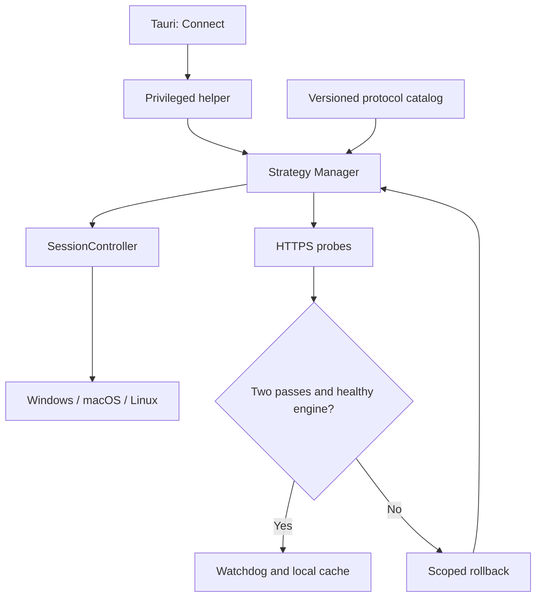

# Architecture

## 1. Components

The control-plane data structures are shared. Privileged network mutations are kept outside the WebView.

## 2. Artifact trust

An engine or dependency may execute only after:

1. its manifest parses and validates;
2. the filename matches;
3. the target platform/architecture matches;
4. the installed bytes match the expected SHA-256.

Windows config can list additional verified bundle dependencies such as `WinDivert.dll` and `WinDivert64.sys`.

CI does not commit opaque engine/driver binaries. Upstream sources/releases are pinned in `third_party/upstream.lock.toml`.

## 3. Strategy model

Strategies are structured TOML rather than shell scripts. The compiler emits deterministic argument vectors for:

- `nfqws`;
- `utunws`;
- `winws2` (CLI selector `winws`).

TCP and UDP profiles are separated with `--new` and receive their own hostlist/ipset/desync arguments.

## 4. Runtime transaction

1. Verify config and artifacts.
2. Validate and compile the protocol rules.
3. Create only owned network resources.
4. Launch the verified engine and journal ownership.
5. Check engine health and service probes.
6. Start the watchdog on success, or roll back before another candidate.

Any startup failure rolls back already-created project resources. A failure to commit the ownership journal after engine launch also triggers rollback.

## 5. Linux

Owned resources:

- nftables table: `inet whitelist_hide`;
- NFQUEUE: 200.

The backend refuses to overwrite an existing table it cannot prove belongs to the new session. Cleanup deletes only that dedicated table. Rules use queue bypass so a missing userspace engine does not intentionally black-hole matching traffic.

## 6. macOS

Owned resources:

- interface: `utun50`;
- local/peer: `10.77.0.1 / 10.77.0.2`;
- PF anchor: `com.apple/whitelist-hide`.

The backend snapshots the default interface/gateway and gateway MAC. If whitelist-hide enables PF, the returned enable token is journaled and released on stop. It does not globally disable or flush PF.

## 7. Windows

The Windows engine is source-built `zapret2/winws2`. The release bundle also carries verified WinDivert runtime files. Runtime health checks require both the recorded engine process and an active WinDivert service/session.

No Winsock/TCP reset is part of normal recovery.

## 8. Helper and watchdog

The helper accepts an allow-list of structured operations. After Start succeeds it launches a watchdog. If the recorded engine or project-owned network resource disappears, the watchdog invokes scoped Stop/rollback.

The helper uses the existing OS-native authorization flow. The new `connect` operation holds the session lock through baseline checks, candidate start/probe/rollback, and final watchdog handoff. Selection does not replace the packet interception backends. See `docs/STRATEGIES.md` for probe limits and cache semantics.

## 9. Release proof

Build success is not equivalent to packet-path correctness. Version 1.0 still requires privileged real-host tests on all three desktop platforms:

- repeated Start/Stop cycles;
- forced engine termination;
- no leaked firewall/routes/services;
- connectivity restoration after rollback;
- installer/uninstaller ownership cleanup.

See `docs/V1_RELEASE_GATE.md`.
